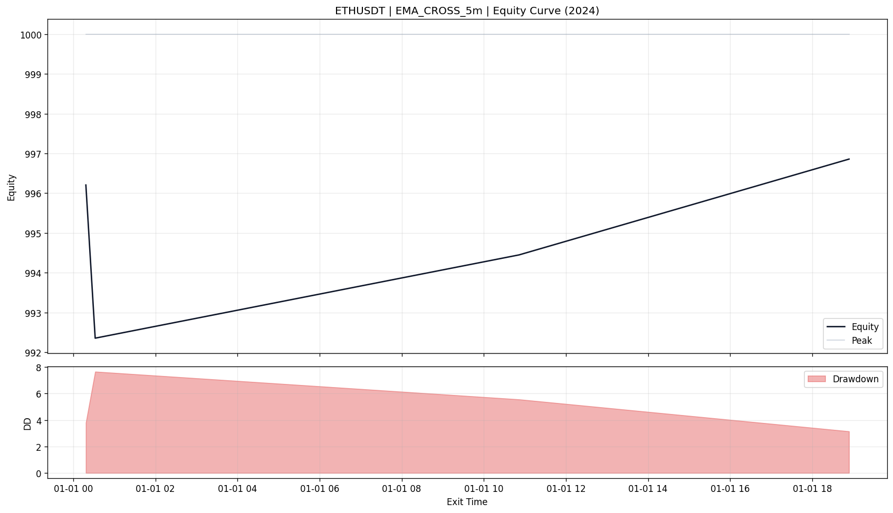

# QuantRiver

QuantRiver is an event-driven backtesting and paper-trading framework for crypto markets. It is structured so strategies, models, gates, and data sources can be swapped without rewriting the engine core.

This public version keeps the architecture, execution flow, and extension points, while removing private research logic, trained artifacts, and order-routing infrastructure.

## What You Get

- event-driven data engine with bounded rivers
- higher-timeframe aggregation from a lower-timeframe source
- backtest runner
- paper runner
- live market-data runner
- two public example strategies
- placeholder model and gate integration seams
- sample ETHUSDT dataset included for a quick local backtest

## What Is Intentionally Not Included

- private model artifacts
- proprietary feature engineering
- private strategy packs
- brokerage credentials
- exchange order execution bridge

The public `live` runner processes live market data and emits execution intents. It does not place exchange orders by itself.

## Quick Start

### 1. Create a virtual environment

PowerShell:

```powershell
py -3 -m venv .venv
.\.venv\Scripts\Activate.ps1
```

Bash:

```bash
python -m venv .venv
source .venv/bin/activate
```

### 2. Install

```bash
pip install -e .
```

### 3. Create your local `.env`

PowerShell:

```powershell
Copy-Item .env.example .env
```

Bash:

```bash
cp .env.example .env
```

### 4. Run the included sample backtest

The repository ships a small sample day at:

`data/klines/ETHUSDT/1s/2024/01/01.parquet`

With the default public `.env.example`, this command should run against that sample:

```powershell
py -3 -m runners.run_backtest
```

Sample output image:



## Repository Layout

```text
QuantRiver-public/
|-- adapters/
|   |-- backtest/
|   `-- live/
|-- core/
|   |-- data_engine/
|   |-- engine/
|   |-- execution/
|   |-- gates/
|   |-- indicators/
|   |-- models/
|   |-- state/
|   |-- strategies/
|   `-- types/
|-- data/
|   `-- klines/
|-- docs/
|-- runners/
|   |-- run_backtest.py
|   |-- run_live.py
|   |-- run_paper.py
|   `-- runtime_config.py
|-- .env.example
|-- pyproject.toml
`-- README.md
```

## Public Strategies

The public repo intentionally keeps only two simple strategies:

- `EMACross5mStrategy`
- `OpeningRangeBreakout5m`

Relevant files:

- `core/strategies/strategy_ema_cross_5m.py`
- `core/strategies/strategy_opening_range_breakout_5m.py`
- `core/strategies/__init__.py`

## Runner Overview

### `runners/run_backtest.py`

Purpose:

- load local parquet candles
- seed warmup history
- run strategies through the event engine
- simulate fills through `BacktestExecutionAdapter`
- write monthly and aggregate reports

Important:

- the public backtest runner uses closed `1s` candle files by default
- the underlying data source and data engine are still designed so you can build custom runners from other source timeframes later

### `runners/run_paper.py`

Purpose:

- consume live Binance market data
- build candles in real time
- run strategies locally
- simulate fills with the paper execution adapter

### `runners/run_live.py`

Purpose:

- consume live Binance market data
- run the engine in real time
- emit execution intents

Important:

- it does not place exchange orders
- it is a market-data and intent-generation example runner

## Configuration

All runners read environment variables either from your shell or from the repo-root `.env` file.

### Shared variables

| Variable | Meaning | Default |
|---|---|---|
| `QR_SYMBOL` | Trading symbol | `ETHUSDT` |
| `QR_ENABLE_EMA_CROSS_5M` | Enable EMA cross | `true` |
| `QR_ENABLE_ORB_5M` | Enable ORB | `false` |

### EMA strategy variables

| Variable | Meaning | Default |
|---|---|---|
| `QR_EMA_FAST_LEN` | Fast EMA length | `12` |
| `QR_EMA_SLOW_LEN` | Slow EMA length | `48` |
| `QR_EMA_STOP_MODE` | `atr` or `usd` | `atr` |
| `QR_EMA_STOP_VALUE` | Stop size in ATR or USD | `1.5` |
| `QR_EMA_TARGET_MODE` | `atr` or `usd` | `atr` |
| `QR_EMA_TARGET_VALUE` | Target size in ATR or USD | `3.0` |

### Backtest variables

| Variable | Meaning | Default |
|---|---|---|
| `QR_KLINES_BASE_PATH` | Root folder for backtest parquet data | `data/klines` |
| `QR_MODEL_KLINES_BASE_PATH` | Root folder for model-native parquet data | `data/model_klines` |
| `QR_REPORTS_BASE_DIR` | Output folder for reports | `backtest_reports` |
| `QR_YEARS` | Years list or inclusive range | `2024,2024` |
| `QR_MONTHS` | Months list or inclusive range | `1,1` |
| `QR_DAY_FROM` | Starting day | `1` |
| `QR_DAY_TO` | Ending day | `1` |
| `QR_AUTO_DAY_TO` | Auto-expand to month end | `false` |
| `QR_START_BALANCE` | Starting equity | `1000` |
| `QR_MAX_WORKERS` | Parallel month workers | `4` |
| `QR_WRITE_AGGREGATE_ARTIFACTS` | Write combined reports | `true` |
| `QR_VERBOSE_MONTH_LOGS` | More console progress | `false` |
| `QR_RUN_NAME_OVERRIDE` | Optional run-name prefix | empty |
| `QR_TRAILING_ENABLED` | Enable trailing logic | `false` |
| `QR_FEE_RATE` | Per-side fee rate | `0.0004` |
| `QR_SLIPPAGE_RATE` | Per-side slippage rate | `0.0002` |
| `QR_BACKTEST_USE_MODELS` | Turn on model layer for backtests | `false` |

### Paper / live variables

| Variable | Meaning | Default |
|---|---|---|
| `QR_IS_USD_M_FUTURES` | `true` for USD-M futures | `true` |
| `QR_BINANCE_REST_BASE_URL` | REST base URL | `https://fapi.binance.com` |
| `QR_BINANCE_REST_TIMEOUT_SEC` | REST timeout | `10` |
| `QR_WS_TIMEOUT_SEC` | WebSocket timeout | `20` |
| `QR_LOG_INTERVAL_SEC` | Console status interval | `1` |
| `QR_USE_MODELS` | Turn on model modules | `false` |
| `QR_USE_GATES` | Turn on placeholder gate evaluation | `false` |

## Data Layout

The sample backtest uses this folder shape:

```text
data/
`-- klines/
    `-- ETHUSDT/
        `-- 1s/
            `-- 2024/
                `-- 01/
                    `-- 01.parquet
```

Expected candle columns:

- `timestamp`
- `open`
- `high`
- `low`
- `close`
- `volume`

Timestamps should be UTC or convertible into UTC by pandas.

## Example Commands

### Run the included sample backtest

```powershell
py -3 -m runners.run_backtest
```

### Run paper mode

```powershell
py -3 -m runners.run_paper
```

### Run live market-data mode

```powershell
py -3 -m runners.run_live
```

## Models And Gates

The public repo keeps these layers for architecture clarity, but ships only placeholder logic.

### Models

Relevant files:

- `core/models/model_module.py`
- `core/models/model_engine.py`
- `core/models/adapters/`

The shipped model engines are lightweight heuristics whose purpose is to preserve wiring and payload shape, not to expose private research logic.

### Gates

Relevant files:

- `core/gates/gate_engine.py`
- `core/gates/manifest.json`

The shipped gate engine is a placeholder pass-through evaluator. It exists to show where strategy filtering happens in the runtime, not to publish a production gate stack.

## Fees, Slippage, Stops

The public runners support:

- fee simulation
- slippage simulation
- ATR-based stops and targets
- fixed-USD stops and targets

The EMA example strategy exposes stop and target modes directly through `.env`.

## Anti-Leakage

Backtests are easy to contaminate accidentally. The short note here explains the main ideas the repo follows:

- `docs/anti_leakage.md`

## Extension Points

If you want to customize the repo cleanly:

1. add new strategies under `core/strategies/`
2. add new backtest or live adapters under `adapters/`
3. add custom runners under `runners/`
4. replace placeholder model adapters under `core/models/adapters/`
5. replace the placeholder gate engine with your own evaluator

## Troubleshooting

### `Klines base path not found`

Set `QR_KLINES_BASE_PATH` to the correct dataset root.

### `At least one strategy must be enabled`

Turn on at least one of:

- `QR_ENABLE_EMA_CROSS_5M=true`
- `QR_ENABLE_ORB_5M=true`

### `QR_USE_GATES=true requires QR_USE_MODELS=true`

This is expected. Gates depend on model context in the runtime flow even though the public gate implementation is only a placeholder.

## License

MIT
